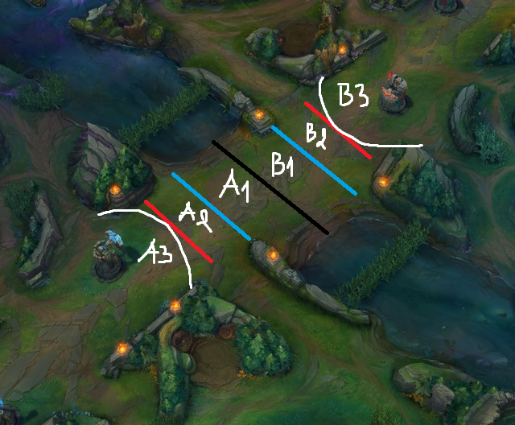

# Game Mechanics — Mid Lane Domain Reference

This file documents League of Legends mid-lane mechanics that inform feature
engineering and data interpretation in this project. Read it before modifying
any function that detects, classifies, or scores in-game behavior — `roam_timing()`,
`death_context()`, `is_throw_game()`, or any new wave-state-aware feature.

This file is not auto-loaded by AGENTS.md. Reference it explicitly in any prompt
touching roam detection, wave-state logic, or objective-timing features.

Where this file conflicts with an assumption baked into existing code, this file
is correct and the code should be revisited.

---

## 1. Mid Lane Wave Geometry

The mid lane wave's position relative to both towers determines almost everything
about roam safety, lane pressure, and jungler/support involvement. The zones below
are an illustrative shorthand for explaining wave states clearly — hand-drawn
boundaries on a screenshot, not measured or precise distances from the game client.
Treat zone names as a way to talk about wave state, not as fixed coordinate
thresholds to encode directly in code.

| Zone | Roughly | Pressures |
|---|---|---|
| A3 | wave inside Side A's tower range, crashed | Side **B** laner — same as A2, intensified; reaching it means walking into A's tower itself |
| A2 | wave pushed toward Side A's tower, but NOT yet crashed | Side **B** laner — must walk deep into A's territory to contest CS/XP |
| A1 | wave on the A-side half of the neutral band | Roughly even — part of the Neutral Band, see below |
| B1 | wave on the B-side half of the neutral band | Roughly even — part of the Neutral Band, see below |
| B2 | wave pushed toward Side B's tower, but NOT yet crashed | Side **A** laner — must walk deep into B's territory to contest CS/XP |
| B3 | wave inside Side B's tower range, crashed | Side **A** laner — same as B2, intensified; reaching it means walking into B's tower itself |

**Critical directionality**: the laner who is pressured is the one whose side
the wave is *not* near, not the side it's pushed toward. A wave sitting in A2
or A3 means the A-side laner can farm safely close to their own tower — it's
the B-side laner who must walk far from home, deep into enemy territory, to
get any CS or XP from that wave, and who is exposed while doing it.

The black line in the image marks roughly where 2 waves meet by default,
assuming neither side is affected by the team-wide advantage condition in
Section 2.6 — a reference point for discussion, not a coordinate. A1 and B1
together make up the Neutral Band described below.

The A2/A3 boundary (and its B-side mirror) is an estimate by eye, not a
confirmed coordinate — precisely detecting whether a wave has actually
entered tower attack range would need tower position and range data, which
may or may not be available from Riot's raw match data. Treat A3/B3 as a
useful concept for discussion, not a precise computed state.

### Neutral Band (A1 + B1)

Both laners can trade, farm, and ward — the position is roughly even.
If the wave is left uncontested (neither laner touches or clears it), the
minions auto-fight each other, and which side's wave attrites faster is
effectively random. This uncontested outcome — not the meeting point itself —
is what creates an unintentional slow push without either player taking an
explicit wave-management action.

Confirmed: with just 2 minion waves fighting (no champion or ability
interference), the outcome is genuinely RNG across a real range. Full survival
of one wave and mutual full wipe are both possible, but the common case is
1–3 minions surviving on one side; 4–5 survivors is rare.

Decision branch available to each laner in this zone: clear the wave quickly
(frees time for warding, jungle invade, or side pressure) versus dropping the
wave entirely to join a jungler fight happening nearby. If both mids drop to
fight, it becomes a 2v2 — high stakes, the losing side loses meaningfully. If
only one mid drops, it becomes a 2v1 in that fight, or lets the other side push
freely while contested.

Advanced wave-pulling and freeze-setup techniques exist within this zone and
are not yet documented here — flagged for future detail.

### Pressure Zone (A2 or B2)

The laner on the *far* side from the wave is the one disadvantaged — they must
walk further from their own tower to reach CS/XP, increasing positional
exposure. This is the natural trigger window for the side whose wave it is
(the near side) to call jungler or support for a gank or zone on the exposed
far-side laner, or to solo-pressure them if strong enough in the 1v1.

For the near side (the side the wave is pushed toward), the wave sitting here
creates three live options: freeze (hold the wave to keep the far-side
opponent extended and exposed), slow-push (continue building toward a crash),
or simply farm safely without needing to extend past a comfortable position.

### Tower Crash (A3 or B3)

Once a wave fully crashes into a tower, the home team has two branch choices,
and which one is correct depends on the relative power state at that moment,
not a fixed rule:

- **Clear/reset** — kill the wave quickly so the next contact resets closer to
  the neutral midpoint, denying any wave-stacking advantage.
- **Controlled slow-clear ("big wave" building)** — only last-hit minimally so
  the wave doesn't fully clear before the next wave arrives, deliberately
  stacking waves into a larger combined push. Typically chosen when ahead or
  strong, to set up a roam window (the wave-state precondition from Section 2.1)
  or a stronger siege/dive later. Reset is typically the correct choice when
  behind or weak, since slow-clearing while weak invites a punish.

The pressure on the far-side laner only intensifies once the wave is fully
crashed — they would now need to walk all the way to the enemy tower itself
to contest anything, which is rarely worth the risk.

### Pressure Beyond the Lane

A2/A3/B2/B3 are lane-specific — they describe pressure created by wave
position, which only makes sense inside the lane corridor itself. Once a
player moves off that corridor (into the river, jungle, or the bushes
flanking the lane), wave state no longer applies, and the simplified
equivalent of pressure becomes **lack of vision**. Any area without vision
— including bushes that look superficially safe — counts as a pressure zone,
since the absence of information about who might be there is itself the risk,
regardless of how the terrain looks.

This distinction matters directly for Section 5: lane pressure (wave-based)
and roam risk (vision-based) are different mechanics that happen to use the
same word, and a feature trying to detect "pressure" needs to know which
domain — lane or off-lane — the player's position falls into before applying
either logic.

---

## 2. Roaming — Six Core Preconditions

Roaming (leaving mid lane to assist another lane or the jungle, roughly
minutes 2–14) is gated by six interacting conditions. None of them work in
isolation — a roam decision is a tradeoff across all six, not a checklist
where each item is independently sufficient.

**2.1 Wave State** — See Section 1. The single most load-bearing condition.
Roam safety and value are gated by which zone the wave occupies and what the
opponent can still do to it (reset, fast-push, or call their jungler to punish
a slow-push).

**2.2 Lane Pressure From Outside** — Enemy jungler or support being missing
from the minimap (and plausibly near mid) restricts movement through implied
threat alone, even without confirmed position. Symmetric for the ally side:
jungler, support, or an off-role laner (pushed out, lost lane, or just
opportunistic) showing up to ward or push the wave alongside you is what
enables a roam in the first place.

**2.3 Resources** — Hard resources: HP, mana, gold, and ability/cooldown
state. A roam attempted with insufficient HP or mana to fight or escape
accomplishes nothing — exception only when the team is already strong enough
and the champion's kit lands hard CC regardless of resource state. This also
covers champion-kit suitability for both sides of the roam: some champions are
built to roam (high mobility, hard CC, burst without needing farm), while
farm-dependent champions lose more by leaving lane than they gain. The receiving
lane's kit matters equally — a numbers advantage is wasted if the lane you roam
to can't capitalize on the opening (no follow-up CC, no burst to convert a slow).

Soft resources: teammates physically present, the movement-speed buff from a
brush kill, and vision — both your own (enables safer movement and threatens the
enemy) and the enemy's (lets them call a response or punish a Pressure Zone
overextension, mirroring the lane-pressure condition above).

**2.4 Jungler Positioning** — Roam value is largely a numbers-advantage play.
An apparent 3v2 at bot loses most of its value, or becomes a liability, if the
enemy jungler is close enough to contest. Requires knowing both junglers'
relative or exact position before committing — wrong information risks losing
the fight, dying, getting cheesed out of mid-lane resources while away, or a
failed dive at disproportionate cost. Mid, jungle, and support are mutually
symbiotic: none of the three can make a fully informed roam, gank, or pathing
decision without information on the other two.

**2.5 Other Lane's State** — Three branches: a losing lane needs you there to
relieve pressure; a winning lane benefits from extending the advantage and
protecting the win condition; a lane in a volatile, critical state needs a
judgment call on whether it's salvageable (commit) or not (cut losses, redirect
elsewhere).

**2.6 Team-Level / Turret-Based Minion Pushing Advantage (edge case)** — When
one team holds an average champion level advantage, their minions gain a pushing
buff (bonus damage dealt, reduced damage taken) that scales further with lane
turret advantage. This mechanic is active from 3:30 onward per external wiki
documentation; unlike the objective timers below, it has not been locally
verified in-client for this project. Re-check it against the current patch
before turning it into a model constant. Gold advantage may correlate with level advantage but is not the
direct trigger — level and turret state are. The stronger team's minions can
push more effectively toward the weaker side because of this buff. This can
shift baseline wave expectations independently of local lane actions, producing
Pressure Zone conditions in Section 1 that the mid laner's own decisions don't
fully explain.

**Best case**: all conditions align — the opponent mid cannot contest the wave
(recalled, dead, or pressured too low to contact it), zero pressure from other
lanes, full or sufficient resources, confirmed information that the enemy
jungler cannot intervene during or after the roam, and the choice of which
lane to roam to is dictated by that lane's actual state rather than habit.

---

## 3. Roaming — Supplementary Modifiers

These are situational, not gating conditions — real considerations, but more
advanced and easier to misapply without solid game sense. Treat them as
modifiers on the six core conditions above, not independent rules.

- **Target feasibility check** — before committing, the specific kill needs to
  be mechanically achievable right now: target's health, available summoner
  spells (Flash up or down, Exhaust, etc.), and escape routes from that location.
- **Counter-roam risk** — if the enemy mid is also missing from lane, they may
  be roaming in the opposite direction simultaneously. A one-sided roam can
  become a mutual trade if the team isn't informed and adjusting.
- **Deliberate vision denial** — actively sweeping or placing control wards
  along the travel path (river bushes, etc.) to deny enemy vision of the roam,
  distinct from passively benefiting from wards already placed for lane safety.
- **Freeze as an alternative to roaming** — sometimes the better play is not to
  roam at all but to freeze the wave near your own tower, denying enemy farm
  and baiting an overextension. A different decision branch sitting next to the
  roam decision, not part of it.
- **Cannon wave timing** — cannon waves take longer to clear under tower and
  longer for the opponent to shove into your tower, extending the safe roam
  window in both directions. Roaming timed around a cannon wave's arrival is
  generally lower-risk.
- **Recall-integrated roaming** — a return-to-base trip can double as a
  low-commitment opportunistic roam by varying the walk path (through river or
  jungle) instead of taking the direct lane route.
- **Stakes scale with game time** — a failed roam early costs little (short
  respawn, low gold lost); the same failure later costs significantly more as
  death timers lengthen. Real risk tolerance for a roam is time-dependent.
- **Other roles roam too** — not mid-exclusive. Top laners rely primarily on
  Teleport to join fights since walking is too slow; supports and junglers can
  pair up to convert what would be a weak solo roam into an effective one.

---

## 4. Objective Timers

Last locally verified in-client by the user on 2026-07-02. These timings are
patch-sensitive and are not auto-validated by this repo. Re-check in-client or
against official patch notes before turning them into model constants.

| Objective | Spawn | Despawn | Notes |
|---|---|---|---|
| Void Grubs | 8:00 | 14:45 | Despawns 15s before Herald spawns |
| Rift Herald | 15:00 | 19:45 | Despawns 15s before Baron spawns |
| Baron Nashor | 20:00 | — | |

---

## 5. Observable vs. Inferred Signals

What Riot's Match-V5 timeline API can and cannot directly provide. Match-V5 is
the confirmed endpoint family for match and timeline data. Static data (champion
names, item names, patch-specific values) comes from Data Dragon, which is
patch-versioned and manually updated — this is why `game_version` is a
first-class column in this project rather than a lookup at query time.

| Concept | Can Riot timeline directly show it? | Safer interpretation |
|---|---|---|
| Champion position | Yes | Good for lane/off-lane classification |
| CS / gold / XP changes | Yes | Good for opportunity-cost estimates |
| Exact wave state | Not fully | Infer cautiously from CS / gold / position / timing |
| Tower crash (A3/B3) | Not directly, unless modeled | Infer from position + wave timing + CS changes |
| Vision pressure | Partially, from ward events if parsed | Useful but incomplete |
| Roam success | Partially | Use kill/assist/objective + opportunity cost |

Any feature that relies on a "not fully" or "not directly" row above is an
approximation, not a measurement. Document the approximation assumption in code
comments and do not treat the output as ground truth.

Dashboard-facing labels must stay proxy-aware. In this repo today:

- Personal gold versus this player's season average is not an in-game gold lead.
- Off-corridor position is not a confirmed roam.
- Kill-only impact is not full roam success; assist-only and objective roams are
  currently missed.
- Missing death snapshots are unknown values, not zero-gold deaths.

---

## 6. Implications for This Codebase

- `roam_timing()` in `features.py` currently approximates roams via a fixed
  position-corridor threshold around the lane axis, with a CS-deviation
  fallback. The Pressure Zone mechanic (Section 1) means a player can
  legitimately walk well off the lane's center axis while still just farming
  under pressure — chasing a pushed wave toward or away from their own tower,
  not roaming. A future refinement should distinguish "moved further along the
  lane axis than usual" (likely Pressure Zone farming) from "moved off the
  lane axis toward another lane or the jungle" (an actual roam).
- Per "Pressure Beyond the Lane" (Section 1), once a player is off the lane
  corridor, vision — not wave state — is the relevant risk signal. If vision
  or ward data becomes available from raw match data in the future, a
  position-plus-vision combination would be a more accurate roam-risk signal
  than position alone. Not currently parsed or stored.
- `roam_timing()` currently treats only player kills during the detected window
  as impact. This undercounts real roam value because the mechanics definition
  of success includes kills, assists, objectives, and opportunity cost. Raw kill
  events include assist IDs, but assists and objective participation are not
  persisted into the current schema.
- `is_throw_game()` and `death_context()` currently use personal gold compared
  with this player's Season 16 mid-lane average. That is a useful personal-pace
  proxy, but it is not an in-game lead or deficit. True throw/overextension
  labels need opponent or team gold, XP, turret/objective state, position, and
  death context. Until then, user-facing docs should call these heuristic
  labels, not ground truth.
- `match_deaths.gold_at_death` can be NULL when no timeline snapshot exists for
  that minute. Downstream classification should leave those cases unknown
  instead of treating missing gold as 0.
- The Neutral Band's uncontested-RNG slow-push means some wave drift visible in
  timeline data is not attributable to either player's explicit decision —
  worth knowing before treating every gold/CS anomaly as a deliberate
  wave-management choice.
- The Tower Crash (A3/B3) two-branch choice (reset vs. controlled big-wave
  build) is the implicit setup condition behind many real roams.
  Cross-referencing whether a detected roam was preceded by a
  crashed-and-slow-cleared wave versus a crashed-and-reset wave could add
  confidence to `roam_timing()`'s output. Not implemented yet.
- Grubs (8:00) and Herald (15:00) are candidate anchor points for a future
  "roam-to-objective" feature. Objective participation is not currently parsed
  or stored — `processor.py` would need new extraction logic and a schema
  update before this is buildable.

---

## 7. Open Items — Not Yet Verified

- Advanced wave-pulling and freeze-setup techniques (flagged for future detail)
- Rename or qualify dashboard proxy labels: Throw, Comeback, Overextension,
  Deficit Fight, and Post-Laning Throw.
- Parse assist and objective events before treating roam success as true impact.